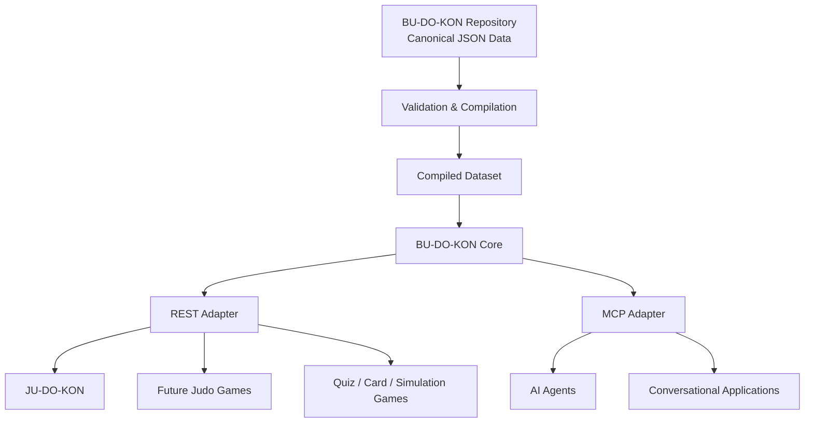
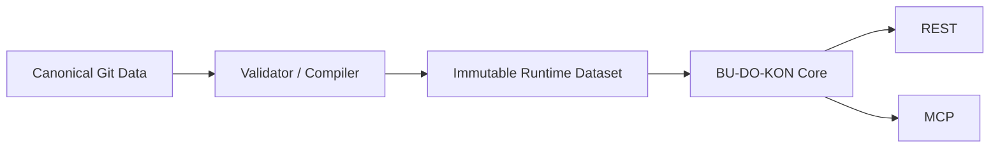
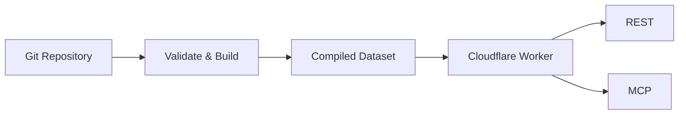
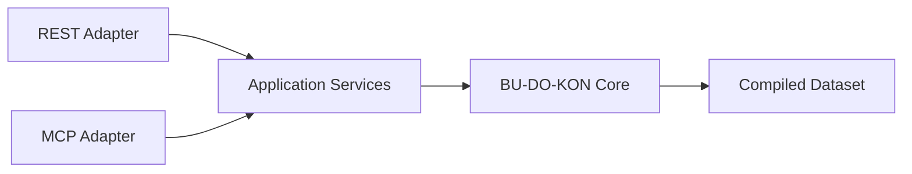
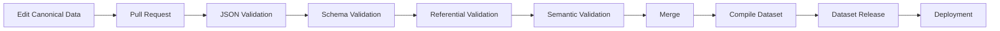

I’ve updated the README to incorporate the architectural recommendations: TypeScript rather than plain JavaScript, Cloudflare/Vercel portability, compiled immutable runtime data, Web API–friendly core logic, bundled JSON as the initial runtime strategy, stronger deterministic draw guarantees, clearer separation of canonical/editing/build/runtime concerns, and delaying SQLite/D1 until justified.

# 🥋 BU-DO-KON

Canonical judoka data for judo games and applications.

BU-DO-KON is a structured, version-controlled library of judoka and related judo data. It acts as a shared source of truth for multiple games and applications that need to select, display, compare, search, or otherwise work with judoka.

Games should normally consume BU-DO-KON through its REST API or MCP interface rather than maintaining separate judoka datasets.

BU-DO-KON deliberately includes both factual attributes and a curated set of editorial/game-friendly attributes such as ratings, rarity, signature techniques, and biography text. These values form the shared BU-DO-KON representation of each judoka and can be reused consistently across different games.

The canonical dataset is intentionally independent of any particular runtime, database, cloud provider, or consuming game.

---

## 🎯 Purpose

BU-DO-KON exists to:

* Maintain a clean, shared catalogue of judoka
* Avoid duplicating judoka data between individual games
* Provide consistent attributes that games can reuse
* Support random and filtered selection of judoka
* Support reproducible deterministic draws
* Keep dataset changes version-controlled and reviewable
* Produce deterministic, immutable dataset releases
* Separate shared judo content from individual game logic
* Support conventional REST APIs and AI-oriented MCP integrations
* Remain portable between hosting environments such as Cloudflare, Vercel, Node.js, and containers

Think of BU-DO-KON as the shared judoka library that sits underneath multiple games.

---

## 🧱 Architecture



BU-DO-KON is built around four layers.

### Canonical data

The Git repository is the editorial source of truth.

Judoka, techniques, countries, weight categories, and other shared judo content are maintained as structured JSON and reviewed through normal Git workflows.

The canonical dataset does not depend on Node.js, TypeScript, Cloudflare, Vercel, SQLite, or any other implementation technology.

### Validation and compilation

Canonical source records are validated and compiled during the build process.

The compiler produces immutable runtime artefacts such as aggregate JSON and a manifest describing the dataset release.

Runtime services should consume these generated artefacts rather than repeatedly reading or assembling the individual canonical files.

### BU-DO-KON Core

The core TypeScript library contains shared application and domain behaviour such as:

* judoka lookup
* search and filtering
* exclusions
* collection membership
* deterministic drawing
* dataset metadata
* technique lookup

The core should remain independent of HTTP, MCP, Cloudflare, Vercel, and game-specific behaviour.

Where practical, runtime code should favour standard Web Platform APIs rather than Node-specific APIs so that the same core can operate across Cloudflare Workers, Vercel, Node.js, and other JavaScript runtimes.

### Interfaces

REST and MCP are thin adapters over the same core application services.

They must not implement separate versions of search, filtering, or drawing behaviour.

Individual games remain responsible for their own:

* rules
* scoring systems
* match state
* progression
* player ownership
* player statistics
* game-specific card identifiers
* game-specific mechanics

---

## 🧭 Architectural Principle

BU-DO-KON should primarily be considered a **versioned judo content catalogue**, rather than a conventional database-backed application.

The relationship is:



Databases, caches, indexes, APIs, and MCP servers are projections or adapters over the canonical catalogue.

They are not the source of truth.

---

## 📂 Proposed Repository Structure

```text
.
├── data/
│   ├── dataset.json
│   │
│   ├── judoka/
│   │   ├── shozo-fujii.json
│   │   ├── ilia-sulamanidze.json
│   │   └── ...
│   │
│   ├── techniques/
│   │   ├── uchi-mata.json
│   │   ├── seoi-nage.json
│   │   └── ...
│   │
│   ├── collections/
│   │   ├── paris-2024.json
│   │   └── ...
│   │
│   └── reference/
│       ├── countries.json
│       └── weight-categories.json
│
├── schema/
│   ├── judoka.schema.json
│   ├── technique.schema.json
│   ├── collection.schema.json
│   ├── countries.schema.json
│   └── weight-categories.schema.json
│
├── src/
│   ├── domain/
│   ├── application/
│   ├── repository/
│   ├── draw/
│   ├── api/
│   └── mcp/
│
├── scripts/
│   ├── validate.ts
│   └── build.ts
│
├── migrations/
│   ├── judoka-legacy-id-map.json
│   └── technique-legacy-id-map.json
│
├── tests/
│
├── README.md
└── LICENSE
```

Generated distribution files may be produced during builds and releases:

```text
dist/
├── budokon.json
├── judoka.json
├── techniques.json
├── collections.json
└── manifest.json
```

An optional derived SQLite database may be added later:

```text
dist/
└── budokon.sqlite
```

Generated files are runtime artefacts rather than primary editorial sources.

---

## 🛠️ Implementation Language

BU-DO-KON uses **TypeScript** for its implementation.

The canonical dataset itself remains plain JSON and JSON Schema and is therefore language-neutral.

TypeScript is used because BU-DO-KON is primarily a structured-data and integration-heavy application rather than a computationally intensive service.

TypeScript provides:

* strong compile-time modelling of domain objects
* excellent JSON and JSON Schema tooling
* natural REST and MCP integration
* first-class support on Cloudflare Workers and Vercel
* straightforward reuse by JavaScript and TypeScript games
* portability across serverless and conventional Node.js runtimes

Performance-sensitive systems languages such as Go or Rust are not currently required for BU-DO-KON's expected workload.

The architecture deliberately keeps the canonical dataset independent of the TypeScript implementation so that alternative consumers or service implementations may be introduced later without migrating the underlying content.

---

## ✏️ Editing and Building the Data

The individual JSON records under `data/judoka/` and `data/techniques/`, together with the files under `data/reference/` and `data/collections/`, are the canonical editorial sources.

Do not edit generated files under `dist/` directly.

After changing source data:

```sh
npm run validate
npm run build
```

The validator parses every canonical source file and applies schema, referential, and semantic validation.

The compiler then creates deterministic runtime aggregates.

Build output must depend only on:

* canonical source data
* compiler version
* defined sorting rules
* source commit

Build output must not depend on wall-clock time or non-deterministic ordering.

---

## 📦 Runtime Dataset

The preferred initial runtime representation is a single compiled immutable JSON dataset.

For example:

```json
{
  "datasetVersion": "2026.08.1",
  "judoka": [],
  "techniques": [],
  "collections": [],
  "countries": {},
  "weightCategories": []
}
```

A hosted BU-DO-KON service may load or bundle this dataset at deployment or process start and keep it in memory.

For the expected size and read-heavy nature of BU-DO-KON, this avoids unnecessary database infrastructure.

The initial runtime model is therefore:

```text
Canonical JSON
      ↓
Validation
      ↓
Compilation
      ↓
budokon.json
      ↓
Runtime memory
      ↓
REST / MCP
```

SQLite, Cloudflare D1, PostgreSQL, or another external database should only be introduced when actual runtime requirements justify the additional complexity.

---

## ☁️ Hosting and Runtime Portability

BU-DO-KON is intended to operate well on serverless platforms such as **Cloudflare Workers** and **Vercel**, while remaining deployable through conventional Node.js or container environments.

The core domain and application logic should therefore avoid provider-specific dependencies.

Where practical, runtime code should favour Web Platform APIs such as:

```text
fetch
Request
Response
URL
URLSearchParams
crypto.subtle
TextEncoder
TextDecoder
```

rather than unnecessary direct dependence on Node-specific APIs.

Node-specific filesystem access is acceptable within build scripts, validation tools, and other development-time tooling.

### Cloudflare

For an initial Cloudflare deployment, the compiled BU-DO-KON dataset may be bundled with the Worker.



This avoids introducing a database simply to serve a small read-only catalogue.

Cloudflare D1 may be considered later if richer relational querying, indexing, or dataset size makes it useful.

D1 should remain a derived runtime representation rather than the editorial source of truth.

### Vercel

A Vercel deployment may expose the same TypeScript core through Node.js functions.

The hosting environment must not change the semantics of BU-DO-KON operations.

In particular:

* identical dataset versions
* identical filters
* identical exclusions
* identical seeds
* identical draw algorithm versions

must produce identical deterministic draw results regardless of hosting provider.

---

## 🧑‍🤝‍🧑 Judoka Data Model

Each judoka contains a curated representation intended to be useful across multiple games.

Example:

```json
{
  "id": "57a86958-73c3-4dd3-b8b8-f0bbaab58b67",
  "slug": "shozo-fujii",
  "firstname": "Shōzō",
  "surname": "Fujii",
  "aliases": [
    "Shozo Fujii"
  ],
  "countryCode": "JP",
  "weightClass": "-81",
  "category": "Judo",
  "gender": "male",
  "personType": "real",
  "stats": {
    "power": 8,
    "speed": 8,
    "technique": 8,
    "kumikata": 7,
    "newaza": 8
  },
  "signatureMoveIds": [
    "seoi-nage"
  ],
  "rarity": "Epic",
  "bio": "Biography text...",
  "profileUrl": "https://example.com",
  "isHidden": false,
  "lastUpdated": "2026-08-13T00:00:00Z"
}
```

The canonical model contains shared judoka attributes only.

Game-specific properties such as:

```text
matchesWon
matchesLost
matchesDrawn
playerOwnership
experiencePoints
cardInstanceId
gameScore
```

must not appear in canonical judoka records.

---

## 👤 Person Type

BU-DO-KON may contain both real and fictional judoka where they provide useful game content.

Records explicitly identify their type.

```json
{
  "personType": "real"
}
```

or:

```json
{
  "personType": "fictional"
}
```

Fictional judoka must represent identifiable, intentional judo characters rather than placeholder identities.

By default, fictional records should be hidden from general draws unless explicitly requested by the consuming application.

This allows consumers to distinguish between:

* factual athlete-oriented experiences
* fictional or entertainment-oriented experiences
* mixed game pools

without attempting to infer the distinction from biography or source URLs.

---

## 🎮 Shared Editorial Attributes

BU-DO-KON intentionally contains attributes that are not purely objective biographical facts.

Examples include:

* `stats.power`
* `stats.speed`
* `stats.technique`
* `stats.kumikata`
* `stats.newaza`
* `rarity`
* `signatureMoveIds`
* biography text

These are editorial values maintained as part of the shared BU-DO-KON representation.

The purpose of storing them centrally is to avoid every consuming game maintaining its own baseline interpretation of the same judoka.

Individual games remain free to:

* ignore attributes they do not need
* transform shared attributes
* derive additional values
* apply their own scoring formulas
* maintain their own player and match state

BU-DO-KON therefore defines a useful shared baseline rather than attempting to model every possible game mechanic.

---

## 🆔 Identity

Judoka use immutable UUID identifiers.

Legacy numeric identifiers are retained only in:

```text
migrations/judoka-legacy-id-map.json
```

for consumer migrations.

Example:

```json
{
  "id": "38690882-06a3-4d98-9b06-2789da1015db",
  "slug": "ilia-sulamanidze"
}
```

### `id`

An immutable UUID assigned in the canonical source record.

UUIDs are stored explicitly and must not be dynamically regenerated during builds.

Once assigned, an ID never changes.

### `slug`

A human-readable identifier suitable for URLs and developer-facing interfaces.

For example:

```text
/v1/judoka/ilia-sulamanidze
```

A slug may change if a spelling or transliteration is corrected.

The UUID must not change.

Previous spellings may be retained in aliases to aid search and backwards compatibility.

---

## 🔤 Names and Aliases

Names may have multiple common transliterations or spellings.

Judoka records may therefore contain aliases:

```json
{
  "firstname": "Shōzō",
  "surname": "Fujii",
  "aliases": [
    "Shozo Fujii"
  ]
}
```

Aliases support:

* alternative transliterations
* diacritic-free spelling
* historic spelling
* common English forms
* improved MCP and search matching

Aliases must not act as alternative canonical identities.

The UUID remains authoritative.

---

## 🌍 Countries

Judoka reference countries using uppercase ISO 3166-1 alpha-2 codes.

For example:

```json
{
  "countryCode": "JP"
}
```

Country names and descriptive information are maintained separately.

```json
{
  "JP": {
    "country": "Japan",
    "code": "JP",
    "active": true
  }
}
```

This prevents duplicate country names from becoming independent sources of truth.

The catalogue represents the subset of ISO countries supported by BU-DO-KON and is not required to contain the complete ISO set.

Keys and embedded `code` values must be identical uppercase alpha-2 codes.

Inactive entries may be retained for historical compatibility and display, but canonical judoka must reference an existing active country unless historical modelling explicitly requires otherwise.

Canonical judoka records must not duplicate the full country display name.

Generated/API representations may expand the country reference for convenience.

---

## ⚖️ Weight Classes

BU-DO-KON currently uses senior IJF weight categories.

### Men

* -60
* -66
* -73
* -81
* -90
* -100
* +100

### Women

* -48
* -52
* -57
* -63
* -70
* -78
* +78

Each judoka is currently assigned one primary weight class.

Where a judoka has competed in multiple divisions, BU-DO-KON uses editorial judgement to select the division most strongly associated with that judoka.

Historical weight-class modelling is outside the current scope.

---

## 🥋 Techniques

Techniques are maintained independently from judoka so they can be reused throughout the catalogue.

Example:

```json
{
  "id": "uchi-mata",
  "name": "Uchi-mata",
  "japanese": "内股",
  "style": "Judo",
  "category": "Nage-waza",
  "subCategory": "Ashi-waza",
  "description": "Inner-thigh throw."
}
```

Technique identifiers are stable kebab-case slugs.

Judoka reference techniques using those identifiers.

```json
{
  "signatureMoveIds": [
    "uchi-mata"
  ]
}
```

Using an array allows a judoka to have more than one recognised signature technique while retaining a simple model.

Technique names are display values and must not be used as foreign keys.

Legacy numeric technique identifiers are retained only in:

```text
migrations/technique-legacy-id-map.json
```

A `null` legacy mapping means that the previous record did not correspond to a recognised technique and has no direct canonical equivalent.

Technique terminology and classification should normally follow recognised Kodokan or IJF conventions.

---

## 🗂️ Collections

Collections allow reusable subsets of the catalogue to be maintained centrally.

Examples might include:

```text
paris-2024
tokyo-2020
japanese-legends
current-world-tour
fictional
```

Example:

```json
{
  "id": "paris-2024",
  "name": "Paris 2024 Olympians",
  "members": [
    "57a86958-73c3-4dd3-b8b8-f0bbaab58b67"
  ]
}
```

Collections allow games to request meaningful shared pools without independently maintaining athlete lists.

For example:

```json
{
  "count": 1,
  "collection": "paris-2024"
}
```

Collections are editorial catalogue metadata and do not contain game progress or player-specific state.

---

## ✍️ Canonical Content Policy

Canonical records must contain intentional, publishable content rather than scaffolding.

Required text must be non-empty.

Biographies should meet a minimum useful content threshold.

Values beginning with common placeholder markers such as:

```text
TODO
TBD
unknown
N/A
none
more info to come
```

should be rejected case-insensitively where substantive content is required.

URLs must be absolute HTTPS URLs.

Stats are integer ratings from 0 through 10.

Unknown properties should be rejected by schemas so that misspellings or application-specific fields cannot silently enter the canonical source.

Fictional judoka may be retained where they represent identifiable judo characters and contain complete, intentional content.

Unverifiable people and invented filler identities do not belong in the canonical catalogue.

---

## ✍️ Editorial Philosophy

BU-DO-KON is a curated passion project rather than an academic or encyclopaedic database.

Some values are intentionally editorial.

This includes decisions such as:

* which weight class best represents a judoka
* which techniques are regarded as signature techniques
* relative ratings
* rarity
* biography wording
* which athletes should be included
* whether an athlete is hidden or available to consumers
* which collections an athlete belongs to

Not every individual field requires formal provenance.

Where practical, profile URLs may provide useful external references, but BU-DO-KON does not require formal source citations for every editorial judgement.

The objective is a consistent, interesting, and useful dataset rather than exhaustive historical documentation.

---

## 🎲 Drawing Judoka

A primary BU-DO-KON capability is selecting one or more judoka from the catalogue.

The draw operation should support:

* random selection
* filtering
* exclusions
* multiple draws without duplicates
* collections
* deterministic seeded draws
* explicit inclusion of hidden content where appropriate

Example:

```http
POST /v1/draw
```

```json
{
  "count": 1,
  "filters": {
    "countryCode": ["JP", "GE"],
    "gender": "male",
    "weightClass": ["-81", "-90"],
    "personType": ["real"]
  },
  "exclude": [],
  "seed": "match-472-round-3"
}
```

Example response:

```json
{
  "datasetVersion": "2026.08.1",
  "drawAlgorithm": "budokon-v1",
  "seed": "match-472-round-3",
  "poolSize": 37,
  "judoka": [
    {
      "id": "57a86958-73c3-4dd3-b8b8-f0bbaab58b67",
      "slug": "shozo-fujii",
      "firstname": "Shōzō",
      "surname": "Fujii"
    }
  ]
}
```

---

## 🎯 Deterministic Randomness

Deterministic draws are part of the public behaviour of BU-DO-KON.

A seed alone is not sufficient to guarantee reproducibility unless the candidate ordering, random-number generator, and sampling algorithm are also defined.

Each deterministic draw therefore has an explicit draw algorithm version.

For example:

```text
budokon-v1
```

A draw algorithm should define:

1. how filters are applied
2. how excluded records are removed
3. how candidate records are canonically ordered
4. how the seed is converted into random state
5. which deterministic PRNG is used
6. how records are sampled or shuffled
7. how multiple results are selected without duplicates

Given:

* the same dataset version
* the same draw algorithm version
* the same filters
* the same exclusions
* the same collection
* the same seed

BU-DO-KON must return the same result.

This enables games to:

* replay rounds
* synchronise multiplayer clients
* reproduce bugs
* audit selections
* regenerate historical game state

Applications that do not require deterministic behaviour may omit the seed.

Changing deterministic draw behaviour requires introducing a new draw algorithm version rather than silently changing the behaviour of an existing version.

---

## 🌐 REST API

The REST API is the primary integration mechanism for conventional games and applications.

Potential endpoints include:

```text
GET  /v1/judoka
GET  /v1/judoka/:id
GET  /v1/techniques
GET  /v1/techniques/:id
GET  /v1/collections
GET  /v1/collections/:id
GET  /v1/countries
GET  /v1/weight-categories
POST /v1/draw
GET  /v1/version
```

Consumers should eventually be able to filter by attributes such as:

```text
GET /v1/judoka?countryCode=JP
GET /v1/judoka?gender=female
GET /v1/judoka?weightClass=-81
GET /v1/judoka?rarity=Legendary
GET /v1/judoka?personType=real
```

Filters may be combined where appropriate.

API responses should expose enough version information to identify the dataset and service behaviour involved.

---

## 🤖 MCP

BU-DO-KON may expose the same core capabilities through MCP for AI agents and conversational applications.

Potential MCP tools include:

```text
get_judoka
search_judoka
draw_judoka
list_techniques
get_technique
list_collections
```

Example:

```json
{
  "count": 2,
  "countryCode": "JP",
  "weightClass": "-81",
  "exclude": [
    "shozo-fujii"
  ]
}
```

MCP and REST must use the same underlying application services.

Business logic must not be duplicated between interfaces.



MCP handlers should translate tool arguments into application requests and translate application responses back into MCP results.

They should not independently implement catalogue rules.

---

## 💾 Storage Strategy

The Git repository is the canonical source of truth.

This provides:

* human-readable data
* clear pull-request review
* full change history
* easy rollback
* deterministic versions
* straightforward backups
* reproducible builds

The runtime service should normally consume the compiled dataset rather than individual source files.

### Initial runtime strategy

The preferred initial runtime strategy is:

```text
Git
 ↓
Canonical JSON
 ↓
Validation
 ↓
Compiled JSON
 ↓
Runtime memory
```

For the expected catalogue size, filtering a dataset held in memory is simpler and likely sufficient.

### SQLite

SQLite may be introduced as a derived read model if indexed querying or richer relationships eventually justify it.

For example:

```text
Canonical JSON
      ↓
Compiler
      ├── budokon.json
      └── budokon.sqlite
```

SQLite is not canonical and must always be reproducible from source data.

### Cloudflare D1

A Cloudflare deployment may eventually use D1 if relational querying becomes useful.

D1 should remain a generated runtime representation and must not become the editorial authority.

### PostgreSQL or external databases

PostgreSQL or another operational database should only be introduced when requirements such as substantial runtime writes, complex concurrency, or significantly larger data volumes justify the additional operational complexity.

---

## ✅ Validation

All canonical data changes must pass automated validation before being merged or released.

Validation should include several layers.

### JSON validation

Every source file must contain valid JSON.

### Schema validation

Records must conform to their relevant JSON Schema.

Examples:

```text
schema/judoka.schema.json
schema/technique.schema.json
schema/collection.schema.json
schema/countries.schema.json
```

Schemas should reject unknown properties.

### Referential validation

References between datasets must exist.

For example:

```text
judoka.signatureMoveIds[]
        ↓
techniques.id
```

and:

```text
collection.members[]
        ↓
judoka.id
```

A judoka must not reference a technique that does not exist.

A collection must not reference a judoka that does not exist.

### Semantic validation

Additional rules should verify domain consistency.

Examples include:

* UUIDs must be unique
* slugs must be unique
* aliases should not ambiguously collide where avoidable
* technique IDs must be unique
* country codes must use uppercase ISO-style alpha-2 values
* country references must exist
* weight classes must be valid for the specified gender
* stat values must be integer values between 0 and 10
* rarity must use an allowed value
* `personType` must use an allowed value
* referenced techniques must exist
* required biographies must not contain placeholder content
* canonical records must not contain game-state properties
* timestamps must be valid RFC 3339 UTC instants
* timestamps must not be in the future

A failed validation must prevent release.

---

## 🏗️ Deterministic Build

The build process reads every canonical source record and produces deterministic runtime artefacts.

Records should be sorted by immutable identity before output.

The build should create:

```text
dist/judoka.json
dist/techniques.json
dist/collections.json
dist/budokon.json
dist/manifest.json
```

The manifest should contain information such as:

```json
{
  "datasetVersion": "2026.08.1",
  "serviceVersion": "1.0.0",
  "sourceCommit": "abc123...",
  "recordCounts": {
    "judoka": 250,
    "techniques": 68
  },
  "artifacts": {
    "budokon.json": {
      "sha256": "..."
    }
  }
}
```

Builds should not contain a wall-clock build timestamp if doing so would make otherwise identical builds produce different artefacts.

---

## 📦 Dataset Releases

BU-DO-KON distinguishes between service versions and dataset versions.

### Service version

Describes behaviour of:

* domain logic
* REST API
* MCP server
* deterministic drawing implementation
* application code

Example:

```text
1.4.0
```

### Dataset version

Describes a particular release of the canonical catalogue.

Example:

```text
2026.08.1
```

Dataset versions use calendar-oriented versioning and are independent of the service package version.

API responses may expose both:

```json
{
  "budokonVersion": "1.4.0",
  "datasetVersion": "2026.08.1"
}
```

A dataset release should be associated with:

* a Git commit
* a dataset release tag
* deterministic compiled artefacts
* checksums

Recommended dataset tags:

```text
dataset-v2026.08.1
```

This allows games to record the exact dataset used for a match, tournament, season, or save game.

Games should normally persist the immutable judoka ID and dataset version rather than copying the entire judoka object into permanent game state.

---

## 🔄 Build and Release Flow



Deployment may target:

```text
Cloudflare Worker
Vercel
Node.js
Docker/container
```

The runtime hosting environment does not change the identity or meaning of a dataset release.

---

## 🧩 Core Application Services

REST and MCP should depend on a small reusable set of application services.

Conceptually:

```ts
getJudoka(...)
searchJudoka(...)
drawJudoka(...)
getTechnique(...)
listCollections(...)
getDatasetMetadata(...)
```

These services should contain the behaviour of BU-DO-KON.

Adapters should contain only transport-specific behaviour.

This architecture allows another consumer to use the core package directly if appropriate:

```ts
import { drawJudoka } from "@budokon/core";
```

without requiring an HTTP round trip.

Remote games can continue using REST.

AI applications can use MCP.

All consumers receive equivalent catalogue semantics.

---

## 🛡️ Design Principles

BU-DO-KON follows these principles.

### One shared judoka catalogue

Games should not maintain duplicate canonical judoka records.

### Git is the editorial authority

The repository remains the canonical representation of the dataset.

### Runtime storage is derived

JSON aggregates, SQLite, D1, caches, and other runtime stores are implementation details and can be regenerated.

### The dataset is language-neutral

Canonical JSON and JSON Schema do not depend on TypeScript or a specific runtime.

### TypeScript powers the reference implementation

TypeScript provides the core, API, MCP, validation, and build tooling while remaining portable across modern serverless environments.

### Shared attributes belong in BU-DO-KON

Reusable ratings, rarity, biographies, signature techniques, aliases, collections, and other catalogue-level metadata may be centrally curated.

### Game state belongs in games

Match results, ownership, progression, scores, achievements, card instances, and player-specific state remain outside BU-DO-KON.

### Editorial judgement is allowed

BU-DO-KON is intended to be useful and enjoyable rather than attempting to become a complete academic historical database.

### Interfaces share business logic

REST, MCP, and direct package consumers use the same application services.

### Infrastructure should remain simple

Databases and additional infrastructure should only be introduced in response to demonstrated requirements.

### Releases are reproducible

A dataset release can be regenerated from its canonical source commit.

### Draws are reproducible

A dataset version, draw algorithm version, seed, filters, exclusions, and collection are sufficient to reproduce a deterministic selection.

### Hosting must not affect semantics

A draw performed on Cloudflare should produce the same result as the equivalent draw on Vercel, Node.js, or another compatible runtime.

---

## 🚀 Potential Future Capabilities

Future development may include:

* richer judoka search
* multiple signature and notable techniques
* historical and retired judoka
* native-language names
* Olympic and World Championship metadata
* competition achievements
* richer aliases and transliterations
* image metadata
* curated collections
* eras or generations
* expansion sets
* weighted draw modes
* tournament-specific pools
* dataset snapshots
* historical weight categories
* full-text search
* public API hosting
* MCP integration
* Cloudflare D1 derived indexes
* generated SQLite distributions
* automated dataset quality checks
* published `@budokon/core` package

These should be introduced without compromising BU-DO-KON's role as a simple, reusable shared judo catalogue.

---

## 🥋 Guiding Principle

**BU-DO-KON maintains the shared representation of a judoka. Games decide what to do with them.**

Adding or updating a judoka once should make that judoka consistently available to every compatible BU-DO-KON game and application.

The canonical catalogue is the product.

REST, MCP, databases, serverless functions, and hosting providers are ways of accessing it.
